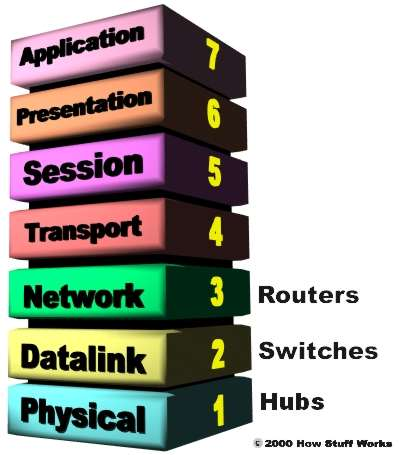
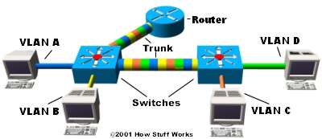

# How does a LAN Work

## Basic terminologies

- **Network** - group of computers connected together in a way that allows information to be exchanges between the computers.
- **Node** - any device connected to the network including peripheral and storage devices.
- **Segment** - a portion of the network seperated by a swith, brdge or router from other parts of the network
- **backbone** - the main cabling to which all segments connect to - usually faster
- **Topology** - Topology is the way that each node is physically connected to the network
- **LAN** - A LAN is a network of computers that in the same general location, usually within a campus
- **WAN** - A Network of computers across towns/cities
- **Network INterface Card (NIC)** - Every networking device is connected to a network through an NIC, usually seen as an Ethernet Card plugged into Motherboard slot on a computer.
- **Media Access Control (MAC)** - This is the physical address of any device - such as the NIC in a computer - on the network. First 3 bytes identify the manufacturer, next 3 bytes are the serial number of the NIC itself.
- **Unicast** - A unicast is a transmission from one node adressed specifically to another node.
- **Multicast** - In a multicast, a node sends a packet adressed to a specail group adress. Devices interested in this group register to recieve packets addressed to the group.
- **Broadcast** - In a braodcast, a node sends out a packet that is intended for transmission to all other nodes on the network.

## Topologies

1. Bus
1. Ring
1. Star
1. Star-Bus

## The problem of Traffic

1. **Scalability** - In a hub network, limited shared bandwidth makes it difficult to accomadate significaant growth without sacrificing performance.
1. **Latency** - This is the amount of time that it takes a packet to get to its destination. Packets have to wait before being transmitted to avoid collisions. Latency increase with an increase in the number of nodes in the networks.
1. **Network Failure** - 
1. **Collisions** - Ethernet uses a process called *CSMA/CD* (Carrier Sense Multiple Access with Collision Detection) to communicate across the network. Under CSMA/CD, a node will not send out a packet unless the network is clear of traffic. If two nodes send out packets at the same time, a collision occurs and the packets are lost. Then both nodes wait a random amount of time before retransmission. Collision occurs between devices part of the same collision domain.

## Switches

A switch reroutes your data to the right destination like a clover leaf bridge as opposed to an intersection (hub).

Important difference between a hub and a switch is that all the nodes connected by a hub share the bandwidth among themselves, while a device connected to a switch can potentailly have all the bandwidth to itself.

## Fully switched network

In a fully switched network, switches replace all the hubs of an Eetherent network with a dedicated segement for every node. The only devices on each segment are the switch and the node. The switch picks up every transmission and then forwards the frame over the appropriate segment. This allows many conversations to happen simultaneously.

Switching allows a network to maintain full-duplex Ethernet - node-to-router communication and router-to-node commincation simultaneously (using different pairs of cables).

Note that this is a collision free environment.

**Note:** Mixed networks consisting of fully-switched networks and hubs are used to keep costs low.

## Routers and switches

Switches work at the layer 2 (Data Layer) using MAC adresses while routers work at layer 3 (Network Layer) using IP addresses. Thus, they vary in the algorithms they use in deciding how to forward the data.

Broadcasts are data packets that are sent either when the device is unsure of the recipient or is addressed to all the devices on the network.

A hub or a switch redirects the data to all the devices on the network, but a router on the other hand will not send data unless it is specifically addressed to a particular device (IP address).

Which is why in trusted local networks a Switch is preferrable, but routers are preffered when networks are required to be kept seperate.

## Packet-switching

LAN swtiches rely on packet-switching. The switch establishes a connection just long enough to send the current packet. Incoming packets are saved to a temporary memory area (buffer); the MAC address contained in the frame's header is read and then compared to the switch's lookup table. In an Ethernet-based LAN, an Ethernet drame contains a normal packet aas the payload of the frame, with a special header that includes the MAc address information for the source and destination of the packet.

Such switches use one of the following methods for routing traffic:

1. **Cut-through switches** read the MAC and begin sending the information to the destination node as the reat of the packet is coming into the switch.
1. **Store-and-forward switch** will save the entire packet to the buffer, checks it for errors and the forwards it to the detination.

> Most switches combine these two methods: using cut-through until a certain error level is reached, beyond which changing to a store-and-forward.

1. Fragment-free

## Switch Confiugurations

LAN Switches vary in their physical design and there are 3 popular configurations in use:

1. **Shared Memory** - Stores all packets on a memory shared by all switch ports and then diverts it to the destination node.
1. **Matrix** - This type of switch has an internal grid with the input ports and output ports crossing each other. When a packet is detected on an input port, the MAC address is compared to the lookup table to find the approproate output port. The switch then makes a connection on the grid where these two points intersect.
1. **Bus architecture** - A common bus is shared by all of the ports using TDMA (Time Division Multiple Access). A swtich based on this configuration has a dedicated memory buffer for each port, as well as an ASIC (Application Specific Integrated Circuit) to control the internal bus access.

## Transparent Bridging

Most Ethernet LAN switches use a very cool system called transparent bridging to create their address lokup tables without the administrator having to do anything. It has 5 parts:

1. Learning - storing location of device's first packet
1. Flooding - sending to all channels when the destination of packet is unknown
1. Forwarding - destination node sends acknowledgement; node location stored
1. Filtering - reciever and destination node on the same segment, so no forwarding required, iignores such packets
1. Aging - the last packet from each node is given a timestamp and stored. When the timestamp expires, the datentry is removed.

## Redundancy

Adding multiple paths between any two nodes to prevent a single point of failure. This causes a problem

### Problem - Broadcast storms

While searching for a particular node on a redundant network, the switches flood the network with a network packet which is broadcast and rebroadcast by each switch, resulting in potentially severe network congestion.

### Solution - Spanning Trees Portocol

The Spanning Tree Algorithm records all possible paths between two nodes and even records them in caase the primary path in unavailable.

***Working of STP***  

Each switch is assigned:
- `Switch ID` AKA `Bridge ID` - 2 byte priority + 8 byte ID
- `port ID` - 6 bit priority setting + 10 bit port number

A path cost value is given to each port. According to the specification its calculated as 1,000 Mbps divided by the bandwidth of the segment, but this has been modified to accomadate for segments with bandwidths upto 10 Gbps. Although this is the official sepcs, a netowork adminisitrator can change these to any arbitrary value.

Every switch begins with a *discovering process* to familiraise itself with the network and choose which paths it should use for reaching eacch segment. This information is shared between all switches by way of special network frames called ***bridge protocol data units (BPDU)***. The parts of a BPDU are:

- Root BID - This is the BID of the current root bridge.
- Path cost to root bridge - Determines how far away the root bridge is. *Note* : The segment attache to the root bridge will normally have a path cost of 0.
- Sender BID - BID of the switch sending BPDU.
- Port ID - Actual port on the switch that the BPDU was sent from.

The switches are constantly sending out BPDUs to maintain records and choose the best path for any particular segments. The other switch's BPDUS which are not taken are stored for later use.

A root bridge is chosen based on the results of the BPDU process between the switches. Each switch communicates with an initial assumption of being the root bridge. If it has a lower BID than the 'then-current' root BID, the root bridge is replaced. Otherwise, upon recieving the BPDU, it changes the root BID in its table to match the networks. 
> **Summary**: Switch with lowest BID is elected as root bridge.

Based on the location of the root bridge, the other sitches determine which of their ports has the lowest cost to the root and names it as the *root port*.

With further commuincation, the switches determine who will have the `designated ports` - the connection used to send and recieve packets on a specific segment, usually having the lowest cost. This prevents looping issues. Other ports which connect to the designated segment become non-designated port and traffic is blocked through it.

Eaach switch has a table of BPDUs that it continually updates. This enables it to handle complex networks, but at the same time is fault-tolerant and fairly easy to maintain.

***NOTE*** : There are also Layer 3 Switches that use routing tables and router algorithms by utilising dynamically programmable hardware which are used to create faster and more efficient switches.

## VLANs / Virtual LANs

These are used to rovide some way of structuring networks logically by grouping a set of nodes within a `single broadcast domain`. Routing between LANs requires a router and a switch will not suffice.

### Reasons for VLANs:

1. Security - seperating systems based on data sensitivity
1. Logical grouping of nodes based on Application
1. Improved Performance - reduces broadcasts and improves traffic flow. Can also create `access lists`.
1. Logical grouping based on users

You can create a VLAN on a switch by logging into it and entering the VLAN parameters. You can have multiple VLANs on the same switch but they cannot communicate without a router (obviously, otherwise it would defeat the whole purpose of creating VLANs).

### VLAN Trunking Protocol (VTP)

To have a VLAN across multiple switches, or mutiple VLANs across multiple switches, a single link between the switches is created.

The VLAN Trunking Protocol is the protocol that switches use to communicate among themselves about VLAN configuration.

In the image above, each switch has two VLANs. On the first switch, VLAN A and VLAN B are sent through a single port (trunked) to the router and through another port to the second switch. VLAN C and VLAN D are trunked from the second switch to the first switch, and through the first switch to the router. This trunk can carry traffic from all four VLANs. The trunk link from the first switch to the router can also carry all four VLANs. In fact, this one connection to the router allows the router to appear on all four VLANs, as if it had four different physical ports connected to the switch.

The VLANs can communicate with each other via the trunking connection between the two switches using the router. For example, data from a computer on VLAN A that needs to get to a computer on VLAN B (or VLAN C or VLAN D) must travel from the switch to the router and back again to the switch. Because of the transparent bridging algorithm and trunking, both PCs and the router think that they are on the same physical segment!

As you can see, LAN switches are an amazing technology that can really make a difference in the speed and quality of a network.